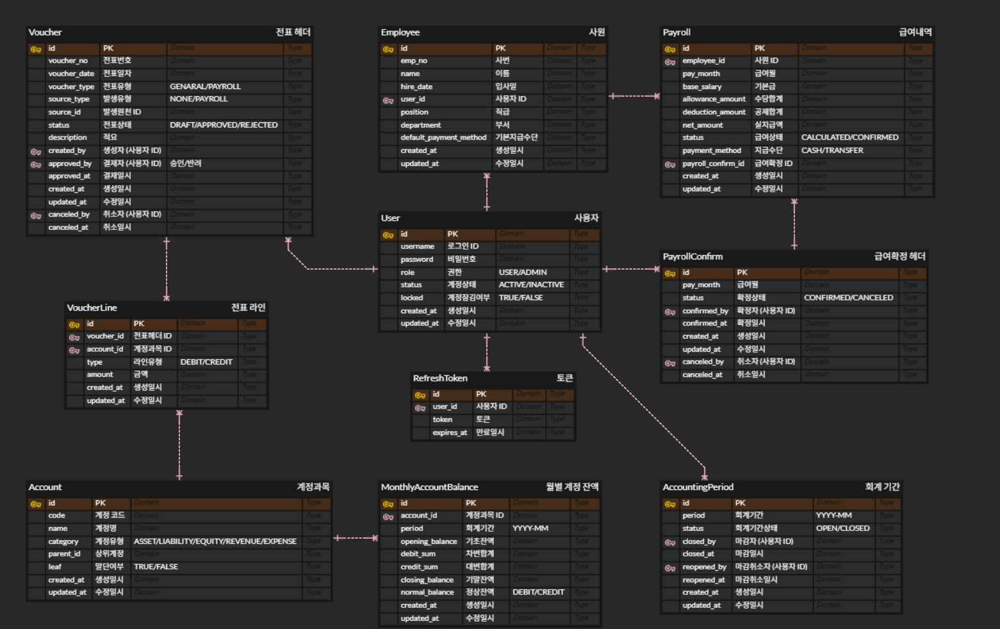
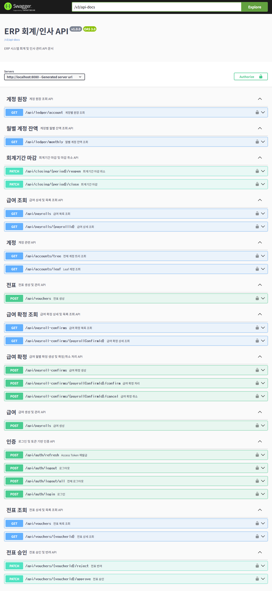

# 💼 ERP Accounting System

> 회계 기간 마감과 급여-전표 연동을 중심으로 구현한 ERP 회계 시스템

**개인 프로젝트** | 2025.12.21 - 2026.02.08 | Backend 100%

---

## 📌 프로젝트 소개

단순 CRUD를 넘어 회계·급여 업무의 데이터 정합성과 트랜잭션 안정성 확보에 집중하여 설계한 ERP 회계 시스템입니다.

- 전표 기반 회계 처리 구조 구현
- 급여 확정 후 자동 분개 처리
- 회계 기간 마감 및 월별 잔액 스냅샷 관리
- JWT + RBAC 기반 인증/인가 적용

---

## ⚙️ 기술 스택

| 분류 | 기술 |
|---|---|
| Backend | Spring Boot, Spring Data JPA, QueryDSL |
| Database | MySQL |
| Security | Spring Security, JWT, RBAC |
| Tool | Git, Github, Swagger, Postman |

---

## 🏗️ 시스템 아키텍처

```text
CLIENT
   ↓
SECURITY (JWT / RBAC)
   ↓
CONTROLLER
   ↓
SERVICE (@Transactional)
   ↓
REPOSITORY (JPA / QueryDSL)
   ↓
MySQL
```

### 특징
- JWT + RBAC 기반 인증/인가
- QueryDSL 기반 동적 검색
- 계층형 구조 기반 관심사 분리
- 트랜잭션 기반 데이터 정합성 관리

---

## ✨ 핵심 기능

### 1. 전표 Lifecycle 기반 회계 처리

```text
전표 생성(DRAFT)
→ 승인(APPROVED)
→ 거래 집계
→ 월별 잔액 계산
```

- ACCOUNTING 권한 기반 승인 처리
- 차변/대변 대차 균형 검증
- 회계 기간 상태 검증

---

### 2. 급여 확정 후 자동 분개

```text
급여 확정(CONFIRMED)
→ 자동 분개 실행
→ 전표 생성 및 승인
→ 회계 데이터 반영
```

- 급여 항목 기반 계정 자동 매핑
- SOURCE=PAYROLL 기반 추적 가능 구조
- 트랜잭션 기반 데이터 일관성 유지

---

### 3. 회계 기간 마감

```text
마감 요청
→ 데이터 집계
→ 잔액 계산
→ 월별 스냅샷 저장
→ 기간 마감 처리
```

- 월별 스냅샷 기반 조회 성능 확보
- 마감 데이터 변경 방지로 정합성 유지

---

## 🔐 인증 / 인가 설계

- JWT 기반 인증 처리
- Access Token / Refresh Token 발급
- RBAC(Role Based Access Control) 적용
- Service Layer 추가 권한 검증

---

## 📐 ERD



---

## 📄 API Documentation

Swagger 기반 API 문서화 적용



---

## 🔧 트러블슈팅

### 1. 마감 이후 잔액 데이터 정합성 문제

**문제**  
마감 이후 데이터 변경 시 과거 기간 잔액이 변동되는 문제 발생

**해결**  
마감 시 월별 잔액 스냅샷 저장 후, 조회 시 마감 여부에 따라 스냅샷/실시간 계산 분기 처리

```java
boolean closed = accountingPeriodService.isPeriodClosed(command.getMonth());

return closed
    ? getFromSnapshot(command)
    : getRealtimeBalance(command);
```

---

### 2. 자동 분개 실패로 인한 데이터 불일치

**문제**  
급여 확정 이후 전표 생성 실패 시 급여·회계 데이터 불일치 발생

**해결**  
명시적 롤백 처리로 데이터 정합성 보장

```java
try {
    confirm.confirm(confirmer);
    autoVoucherService.createFromPayrollConfirm(confirm);
} catch (RuntimeException e) {
    confirm.rollbackToCreated();
    throw e;
}
```

---

## ✅ 테스트 및 안정성 검증

- SpringBootTest 기반 통합 테스트 수행
- 자동 분개 트랜잭션 검증
- 회계 기간 마감 데이터 무결성 검증
- 권한 기반 접근 제어 테스트

---

## 🚀 실행 방법

```bash
# 1. 레포지토리 클론
git clone https://github.com/zy23n/erp-accounting.git

# 2. 환경 변수 설정
DB_USERNAME
DB_PASSWORD
JWT_SECRET

# 3. application.yaml.example 복사
cp src/main/resources/application.yaml.example \
src/main/resources/application.yaml

# 4. 실행
./gradlew bootRun
```

---

## 💭 회고

- 회계 흐름(전표 → 승인 → 마감)을 직접 모델링하며 도메인 중심 설계를 경험했습니다.
- 자동 분개 실패 상황을 처리하며 트랜잭션과 데이터 정합성의 중요성을 체감했습니다.
- QueryDSL 및 계층형 구조를 적용하며 유지보수성과 확장성을 고려한 설계를 고민했습니다.

---

## 📬 Contact

- GitHub: https://github.com/zy23n
- Email: szy23n@gmail.com